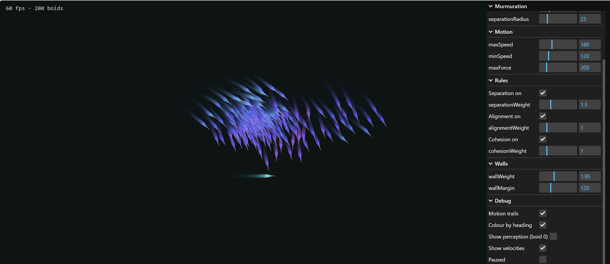

# Murmuration

A browser-based simulation of starling-style flocking, built with Vite + TypeScript and Canvas 2D. Implements Craig Reynolds' three-rule boid model — separation, alignment, cohesion — and renders a few hundred arrowheads wheeling around the screen in real time.



## What it does

Each boid is a point with a position and a velocity. Every frame, every boid:

1. Looks at all neighbours within its perception radius
2. Computes three steering forces:
   - **Separation** — push away from neighbours that are too close, weighted by `1 / distance`
   - **Alignment** — match the average heading of nearby neighbours
   - **Cohesion** — steer toward the average position of nearby neighbours
3. Adds a fourth force near the canvas edges that nudges it back inward (soft walls)
4. Integrates: `velocity += accel · dt`, clamped to `[minSpeed, maxSpeed]`, then `position += velocity · dt`

No boid knows about "the flock." Flocking, splintering, and rejoining all emerge from those local rules.

## Running it

```bash
npm install
npm run dev
```

Open the URL Vite prints (usually `http://localhost:5173`). The control panel is top-right; FPS and boid count are top-left.

## Build

```bash
npm run build
npm run preview
```

## Project layout

```
src/
├── main.ts                 Entry point, render loop, DPI handling
├── config.ts               Single tunable Config object (read live every frame)
├── style.css               Full-bleed canvas, dark backdrop
├── simulation/
│   ├── Vector2.ts          2D vector helpers
│   ├── Boid.ts             { position, velocity } — nothing else
│   ├── rules.ts            The three Reynolds rules + neighbour scan
│   └── Flock.ts            Update pipeline, wall force, double-buffered integration
├── render/
│   └── Renderer.ts         Canvas 2D draw, debug overlays
└── ui/
    └── gui.ts              lil-gui control panel
```

The three tiers — simulation, render, ui — are kept in separate folders. The simulation has no knowledge of the canvas; the renderer is a read-only consumer of the flock.

## Implementation notes

**Reynolds steering.** All three rules and the wall force use the same pattern:

```
desired = (target vector, normalised to maxSpeed)
steer   = desired - currentVelocity
steer   = limit(steer, maxForce)
```

The `desired - current` subtraction is what makes motion smooth. Setting velocity directly to `desired` produces robotic snap-rotations; subtracting current velocity turns it into a gentle nudge per frame. `maxForce` caps that nudge — it's effectively the boid's turning radius. Lower values produce wider, more graceful banking arcs.

**Double-buffered update.** Each frame is two passes: pass one computes new accelerations from the current state of all boids; pass two integrates them. This means boid #50 sees the same world snapshot as boid #1 — the update is order-independent. Without it, boids processed later in the array would behave subtly differently than earlier ones.

**dt-based timestep.** Motion is multiplied by elapsed seconds since the last frame, so the simulation runs the same on 60Hz, 144Hz, or 165Hz monitors. `dt` is clamped to `1/30s` to prevent the sim from exploding when the tab regains focus after being backgrounded.

**Naive O(n²) neighbour search.** Every boid checks every other boid. Comfortable up to ~500 boids; beyond that, frame rate sags. The neighbour-gathering code is isolated in `rules.ts::gatherNeighbourStats` so a uniform spatial grid can be dropped in later without touching the rules themselves.

**Single shared scratch object.** The neighbour stats for one boid live in a single reusable object on the `Flock` instance, refilled each iteration. This keeps GC pressure down — at 200 boids × 60fps that's 12,000 avoided allocations per second.

## Tunable parameters

All exposed live in the GUI panel:

| Group | Parameter | Notes |
|---|---|---|
| Population | `boidCount` | 10–1500. Resizes the flock without resetting. |
| Perception | `perceptionRadius` | Alignment + cohesion range. |
| Perception | `separationRadius` | Should be smaller than perception (typical 2:1 to 3:1 ratio). |
| Motion | `maxSpeed`, `minSpeed` | px/sec. Minimum prevents stalling. |
| Motion | `maxForce` | Turn-rate cap. Lower = wider arcs = more graceful. |
| Rules | `enableSeparation/Alignment/Cohesion` | Per-rule on/off for debugging. |
| Rules | `separation/alignment/cohesionWeight` | Multipliers on each rule's force. |
| Walls | `wallWeight`, `wallMargin` | How hard and how early to bank away from edges. |
| Debug | `trailMode` | Translucent overlay instead of hard clear — motion trails. |
| Debug | `colourByHeading` | HSL by velocity angle. Makes alignment visually obvious. |
| Debug | `showPerceptionRadius` | Visualise perception + separation radii on boid 0. |
| Debug | `showVelocityVectors` | Draw velocity as a line on every boid. |
| Debug | `paused` | Stop the simulation but keep rendering. |

## Tuning tips

- **Twitchy boids?** `maxForce` too high. Try halving it.
- **Boring slow blob?** Cohesion dominates. Reduce `cohesionWeight` or raise `separationWeight`.
- **Flock never splinters?** `perceptionRadius` too large — boids can always see each other.
- **Flock never reforms?** `perceptionRadius` too small — sub-groups drift permanently out of mutual sight.
- **Best murmuration aesthetic:** lower `maxForce` (~80), moderate `wallWeight` (~1), perception:separation ratio around 2.5:1.

## Roadmap

- [ ] Predator boids — flock flees, predator pursues
- [ ] Mouse interaction — cursor as attractor / repulsor
- [ ] Uniform spatial grid — O(n²) → O(n), unlocks several thousand boids
- [ ] Wind / global force field
- [ ] Obstacle avoidance
- [ ] 3D (WebGL port)

## References

- Reynolds, C. (1987). *Flocks, herds, and schools: A distributed behavioral model.* SIGGRAPH '87. The original paper that introduced the three-rule model and coined "boid."
- [red3d.com/cwr/boids](https://www.red3d.com/cwr/boids/) — Reynolds' own page with later refinements and references.

## Stack

- [Vite](https://vitejs.dev/) + TypeScript
- Canvas 2D
- [lil-gui](https://lil-gui.georgealways.com/) for the control panel

## License

MIT.
